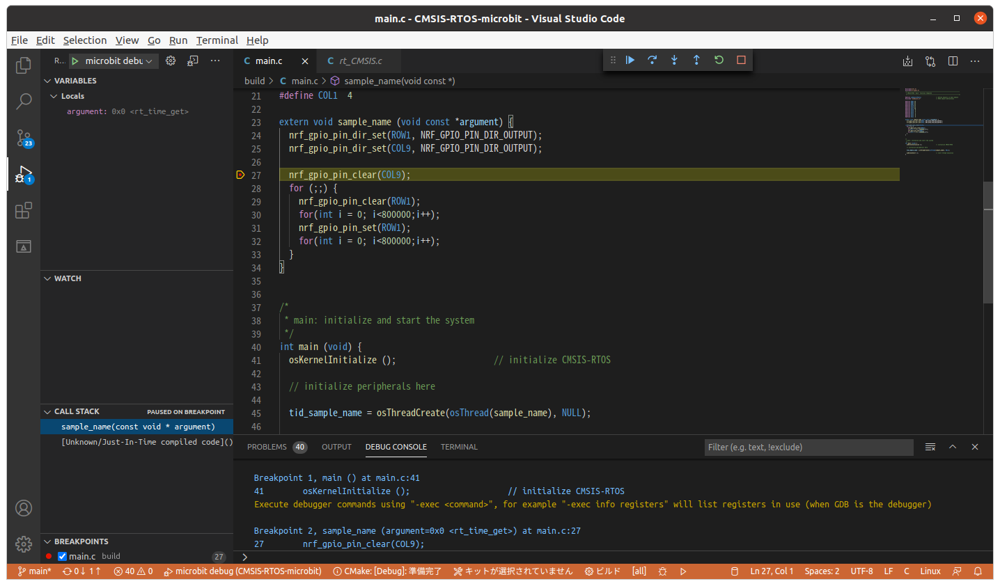

# CMSIS-RTOS-microbit
CMSIS RTOS on microbit

# Requirements

* [microbit Ver 1.5](https://tech.microbit.org/hardware/1-5-revision/)
* arm-none-eabi-gcc
```
$ arm-none-eabi-gcc --version
arm-none-eabi-gcc (GNU Tools for Arm Embedded Processors 7-2018-q2-update) 7.3.1 20180622 (release) [ARM/embedded-7-branch revision 261907]
Copyright (C) 2017 Free Software Foundation, Inc.
This is free software; see the source for copying conditions.  There is NO
warranty; not even for MERCHANTABILITY or FITNESS FOR A PARTICULAR PURPOSE.
```
* qemu
```
$ qemu-system-arm --version
QEMU emulator version 4.2.1 (Debian 1:4.2-3ubuntu6.8)
Copyright (c) 2003-2019 Fabrice Bellard and the QEMU Project developers
```

# build

```sh
$ ./get-src-build-newlib.sh
# It's take some time.
$ cd build
$ make
```

# Run on microbit

Copy `main.hex` to microbit

# debug on qemu

1. Run qemu
```
$ cd build
$ qemu-system-arm -M microbit -device loader,file=main.hex -serial stdio -s -S
```
2. Run debug on Visual Studio Code


# Link

* https://github.com/ARM-software/CMSIS_5.git
* https://github.com/NordicSemiconductor/nrfx.git
* https://sourceware.org/git/newlib-cygwin.git
